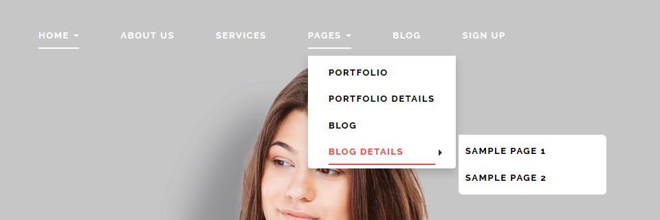
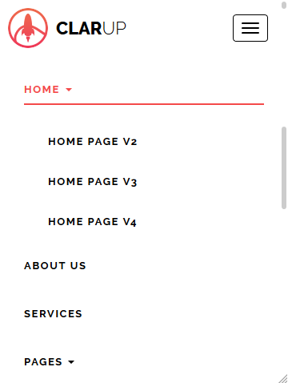

# Site Navigation





### Site Navigation HTML Code {#site-navigation-html-code}

The below code can be found in all HTML pages that are included with the theme. code will be placed from 149th to 188th line of each page.

```markup
<ul class="nav navbar-nav navbar-right underline">
    <li class=" active  dropdown "><a data-toggle="dropdown" href="index.html" title="HOME"
                                      id="home">HOME <span class="caret"></span></a>
        <ul class="dropdown-menu">
            <li class=""><a href="home-page-v2.html" title="HOME PAGE V2" id="home-2">HOME PAGE
                V2</a></li>
            <li class=""><a href="home-page-v3.html" title="HOME PAGE V3" id="home-3">HOME PAGE
                V3</a></li>
            <li class=""><a href="home-page-v4.html" title="HOME PAGE V4" id="home-4">HOME PAGE
                V4</a></li>
            <li class=""><a href="home-page-v5.html" title="HOME PAGE V5" id="home-5">HOME PAGE
                V5</a></li>
        </ul>
    </li>
    <li class=""><a href="about-us.html" title="ABOUT US" id="about-us">ABOUT US</a></li>
    <li class=""><a href="services.html" title="SERVICES" id="services">SERVICES</a></li>
    <li class=" dropdown "><a data-toggle="dropdown" href="#" title="PAGES" id="pages">PAGES <span
            class="caret"></span></a>
        <ul class="dropdown-menu">
            <li class=""><a href="portfolio.html" title="PORTFOLIO" id="portfolio">PORTFOLIO</a>
            </li>
            <li class=""><a href="portfolio-details.html" title="PORTFOLIO DETAILS"
                            id="portfolio-details">PORTFOLIO DETAILS</a></li>
            <li class=""><a href="blog.html" title="BLOG" id="blog">BLOG</a></li>
            <li class=" dropdown "><a data-toggle="dropdown" href="blog-details.html"
                                      title="BLOG DETAILS" id="blog-details">BLOG DETAILS <span
                    class="caret"></span></a>
                <ul class="dropdown-menu">
                    <li class=""><a href="#" title="SAMPLE PAGE 1" id="sample-1">SAMPLE PAGE 1</a>
                    </li>
                    <li class=""><a href="#" title="SAMPLE PAGE 2" id="sample-2">SAMPLE PAGE 2</a>
                    </li>
                </ul>
            </li>
        </ul>
    </li>
    <li class=""><a href="blog.html" title="BLOG" id="blog-page">BLOG</a></li>
    <li class=""><a href="contact.html" title="SIGN UP" id="contact-us">SIGN UP</a></li>
</ul>
```

